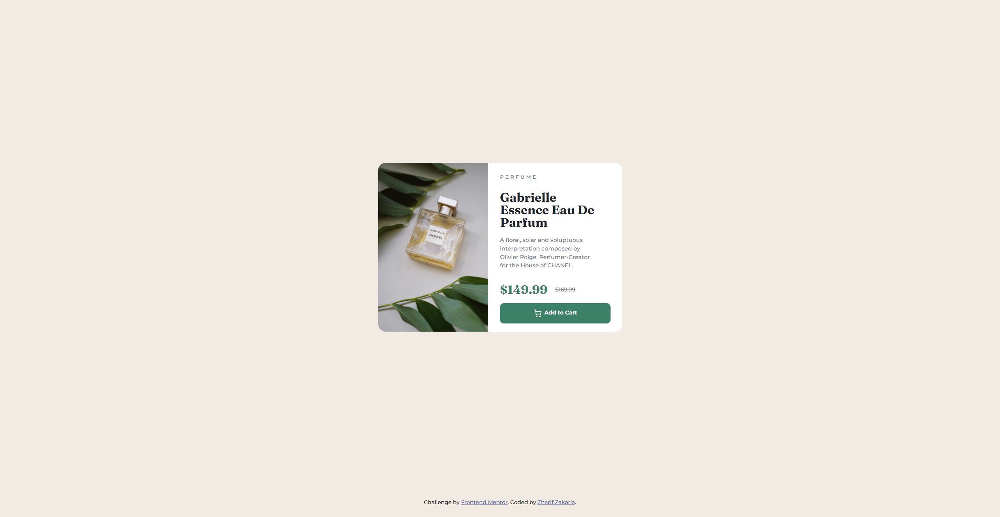

# Frontend Mentor - Product preview card component solution

This is a solution to the [Product preview card component challenge on Frontend Mentor](https://www.frontendmentor.io/challenges/product-preview-card-component-GO7UmttRfa). Frontend Mentor challenges help you improve your coding skills by building realistic projects. 

## Table of contents

- [Frontend Mentor - Product preview card component solution](#frontend-mentor---product-preview-card-component-solution)
  - [Table of contents](#table-of-contents)
  - [Overview](#overview)
    - [The challenge](#the-challenge)
    - [Screenshot](#screenshot)
    - [Links](#links)
  - [My process](#my-process)
    - [Built with](#built-with)
  - [Author](#author)

**Note: Delete this note and update the table of contents based on what sections you keep.**

## Overview

### The challenge

Users should be able to:

- View the optimal layout depending on their device's screen size
- See hover and focus states for interactive elements

### Screenshot

### Links

- Solution URL: [https://github.com/zharifzakaria/product-preview-card-component-main](https://github.com/zharifzakaria/product-preview-card-component-main)
- Live Site URL: [https://zharifzakaria.github.io/product-preview-card-component-main/](https://zharifzakaria.github.io/product-preview-card-component-main/)

## My process

### Built with

- HTML5
- SCSS
- Flexbox

## Author

- Frontend Mentor - [@zharifzakaria](https://www.frontendmentor.io/profile/zharifzakaria)
